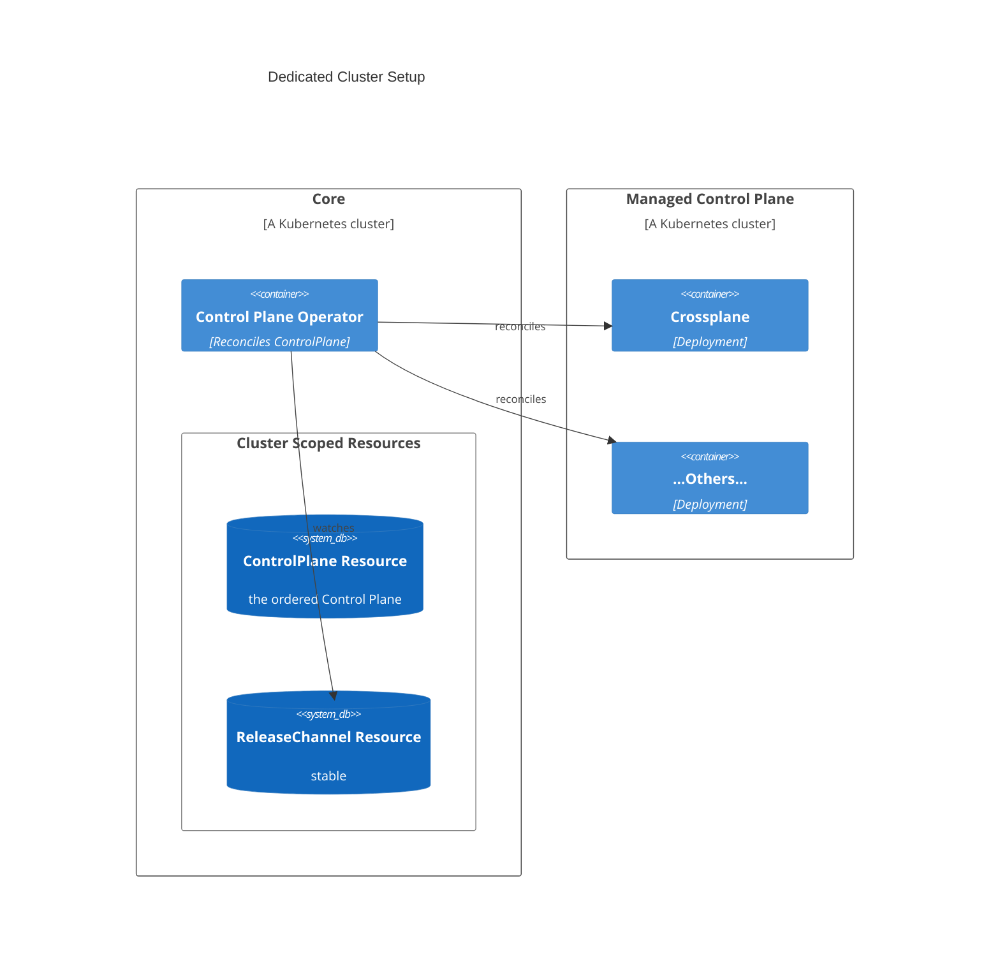
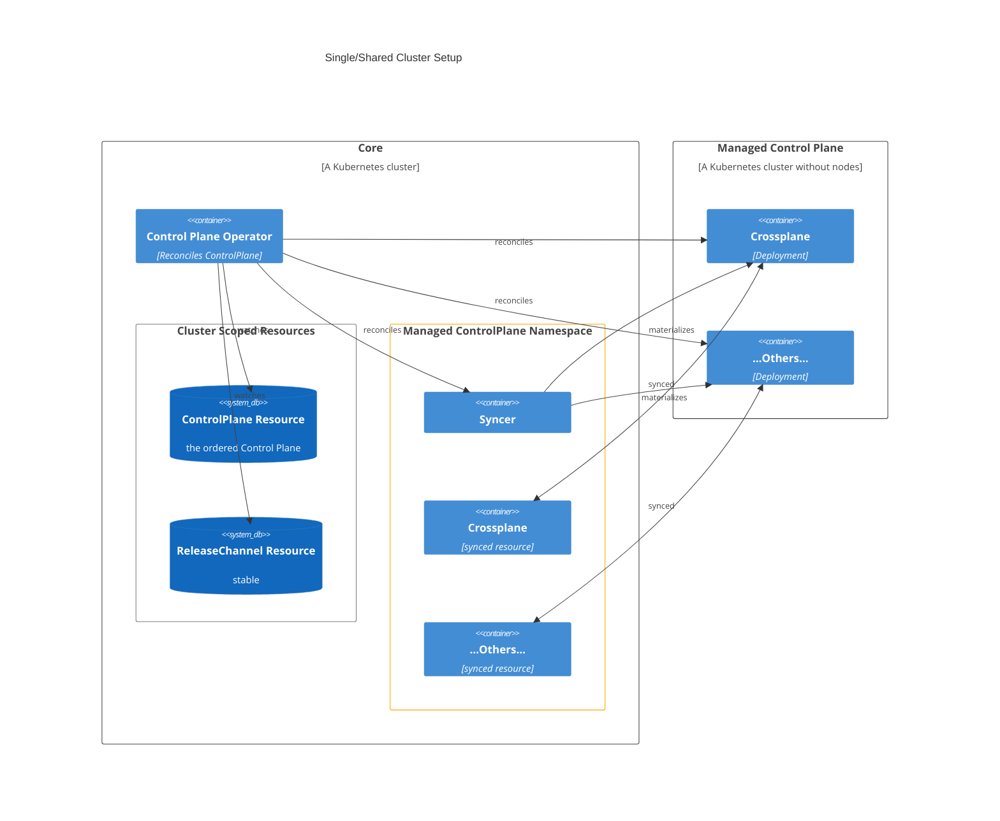

# Control Plane Operator

## About this project
The Control Plane Operator is a universal Kubernetes Operator which bundles all necessary functionality to automate the lifecycle of so called `Components` (like Crossplane, External Secrets Operator, etc.) in a managed fashion into a Kubernetes cluster.

The Control Plane Operator is part of the openMCP project. It exposes the [`ControlPlane` API](./config/crd/bases/core.orchestrate.cloud.sap_controlplanes.yaml), where `Components` can be configured that should be reconciled on another Kubernetes cluster. With openMCP, the `ControlPlane` is not directly exposed to an end user. Instead, the `ManagedControlPlane` API is the facade. The [mcp-operator](https://github.com/openmcp-project/mcp-operator) is interacting with the `ControlPlane` API.

## Using the Control Plane Operator in a Managed Setup

With the Managed setup, we will use this Operator in our OpenMCP landscape to provide a new API called `ManagedControlPlane`.

With the `ManagedControlPlane` you will also have two different cluster setups how the MCP will look like:
- Dedicated Cluster Setup - A standard Kubernetes cluster
- Single/Shared Cluster Setup - A Kubernetes cluster without nodes

#### Dedicated Cluster Setup
In the Dedicated Cluster Setup, the "Managed Control Plane" will be a standard Kubernetes cluster.
The Control Plane Operator will reconcile the `ControlPlane` CR in which the necessary `Components` e.g. Crossplane, External Secrets Operator are defined.
The Control Plane Operator will then install these `Components` on the `Managed Control Plane`.
The ReleaseChannel resources (stable and latest) are watched by the Control Plane Operator.
A ReleaseChannel defines the concrete version of the `Components`.

#### Single/Shared Cluster Setup
In the Single/Shared Cluster Setup, the "Managed Control Plane" will be a Kubernetes cluster without nodes e.g. a Gardener Workerless Shoot.
To run Crossplane and other Components on the MCP, the Syncer will schedule and forward the workload to the Core cluster.
That comes with cost advantages for the user of the Managed Control Plane.

## Requirements and Setup

You’ll need a Kubernetes cluster to run against. You can use [KIND](https://sigs.k8s.io/kind) to get a local cluster for
testing, or run against a remote cluster.
**Note:** Your controller will automatically use the current context in your kubeconfig file (i.e. whatever
cluster `kubectl cluster-info` shows).

### Simple Development Setup

1. Run `make dev-base` to create a KIND cluster on your local machine. This will install Flux, the Control Plane Operator via Helm along with the `ControlPlane` CRD, too.
2. Apply your `ControlPlane` CR which is located under `config/samples/` via kubectl. The `controlplane_local.yaml` is a good example to start with.
3. If you want to tear down the cluster, simply execute `make dev-clean`.

If you want to execute the Control Plane Operator outside the KIND cluster, you can use the following commands:

1. Run `make dev-local` to create a local cluster on your machine. This will install Flux too.
2. Run the Control Plane Operator via `make dev-run` or start the `cmd/main.go` file via your IDE.
3. Apply your `ControlPlane` CR which is located under `config/samples/` via kubectl. The `controlplane_local.yaml` is a good example to start with.
4. If you want to tear down the cluster, simply execute `make dev-clean`.

### Uninstall CRDs

To delete the CRDs from the cluster execute: `make uninstall`.

### Running E2E-Tests
To run E2E-Tests you can execute `make e2e`. This will execute all tests in the `test/e2e/` directory.

### Modifying the API definitions

If you are editing the API definitions, generate the manifests such as CRs or CRDs using `make manifests`.

### How it works

This project aims to follow the
Kubernetes [Operator pattern](https://kubernetes.io/docs/concepts/extend-kubernetes/operator/) and is based on [Kubebuilder](https://book.kubebuilder.io/).

It uses [Controllers](https://kubernetes.io/docs/concepts/architecture/controller/),
which provide a reconcile function responsible for synchronizing resources until the desired state is reached on the
cluster.

**NOTE:** Run `make --help` for more information on all potential `make` targets

More information can be found via the [Kubebuilder Documentation](https://book.kubebuilder.io/introduction.html)

## Support, Feedback, Contributing

This project is open to feature requests/suggestions, bug reports etc. via [GitHub issues](https://github.com/openmcp-project/control-plane-operator/issues). Contribution and feedback are encouraged and always welcome. For more information about how to contribute, the project structure, as well as additional contribution information, see our [Contribution Guidelines](CONTRIBUTING.md).

## Security / Disclosure
If you find any bug that may be a security problem, please follow our instructions at [in our security policy](https://github.com/openmcp-project/control-plane-operator/security/policy) on how to report it. Please do not create GitHub issues for security-related doubts or problems.

## Code of Conduct

We as members, contributors, and leaders pledge to make participation in our community a harassment-free experience for everyone. By participating in this project, you agree to abide by its [Code of Conduct](https://github.com/SAP/.github/blob/main/CODE_OF_CONDUCT.md) at all times.

## Licensing

Copyright 2025 SAP SE or an SAP affiliate company and control-plane-operator contributors. Please see our [LICENSE](LICENSE) for copyright and license information. Detailed information including third-party components and their licensing/copyright information is available [via the REUSE tool](https://api.reuse.software/info/github.com/openmcp-project/control-plane-operator).
