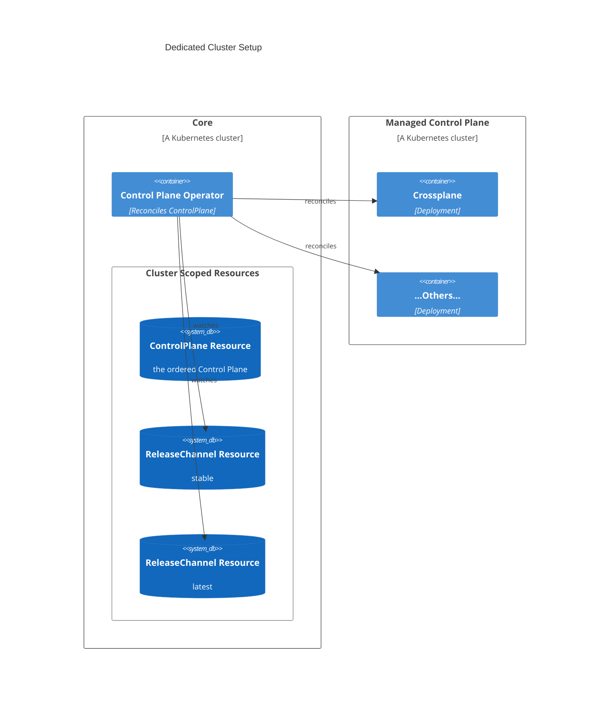
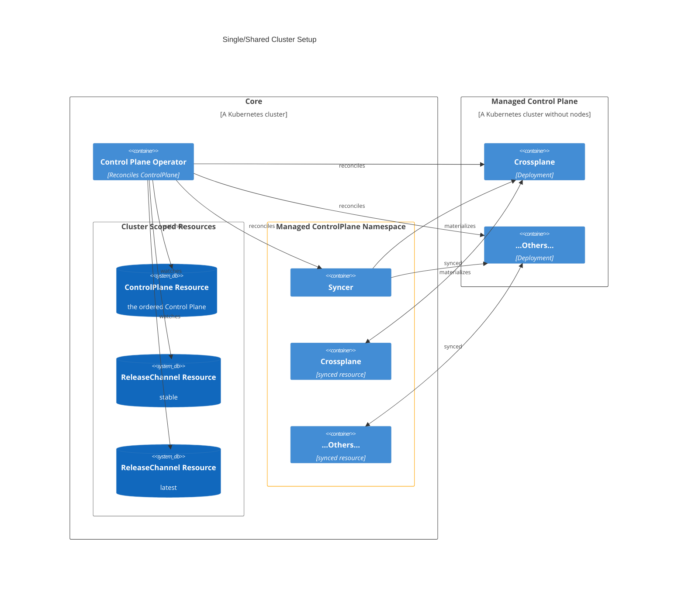

[](https://api.reuse.software/info/github.com/openmcp-project/control-plane-operator)

# Control Plane Operator

## About this project
The Control Plane Operator is a universal Kubernetes Operator which bundles all necessary functionality to install so called `Components` (like Crossplane, External Secrets Operator, etc.) in a managed fashion into a Kubernetes cluster.

The Control Plane Operator can be used in different flavors and scenarios:
- [Self-hosted](#self-hosted): You install the Control Plane Operator into your own Kubernetes cluster.
  * You can install `Components` like Crossplane, External Secrets Operator, etc. via one central [`ControlPlane` API](./config/crd/bases/core.orchestrate.cloud.sap_controlplanes.yaml). For more information see the [Components](#components) section.
  * You are responsible running and if necessary upgrading the Control Plane Operator.
- [Managed](#managed): You are using a Managed Control Plane offering, where you order a `ManagedControlPlane` either via an API or via an Onboarding system.
  

## Flavors

### Self-hosted

**PLEASE EXPECT SOME HICK-UPS WHEN SETTING UP THE OPERATOR IN A SELF-HOSTED SCENARIO. The following instructions might not be up-to-date.**

If you want to use the Control Plane Operator in your own Kubernetes cluster, please follow the instructions below.
Make sure you are connected to a Kubernetes cluster that should serve as ControlPlane environment.

```shell
# Add helm repo
helm repo add control-plane-operator-repo \
    https://helm.example.com/control-plane-operator-repo \
    --force-update \
    --username <d/i-user>

# Create namespace where you install the Operator and Secrets
kubectl create namespace cloud-orchestration

# Create secret to pull Helm Charts from Artifactory
kubectl create secret docker-registry orchestrator-registry \
    --namespace cloud-orchestration \
    --docker-server="docker-registry.example.com/" \
    --docker-username=<docker user> \
    --docker-password=<Your token>

# Install FluxCD
kubectl apply -f https://github.com/fluxcd/flux2/releases/latest/download/install.yaml

# Create secret to pull Crossplane Providers from Artifactory
kubectl create secret generic artifactory-readonly-basic --type=kubernetes.io/basic-auth --from-literal=username=<docker user> --from-literal=password=<Your token>
kubectl label secret artifactory-readonly-basic core.orchestrate.cloud.sap/copy-to-cp-namespaces=true
kubectl annotate secret artifactory-readonly-basic core.orchestrate.cloud.sap/credentials-for-url='https://helm.example.com/control-plane-operator-repo'

# Install the Control Plane Operator into your cluster
helm upgrade --install co-control-plane-operator control-plane-operator-repo/co-control-plane-operator --namespace cloud-orchestration --set "imagePullSecrets[0].name=orchestrator-registry" --values test/e2e/testdata/values.yaml
```

After the installation you will see that a Pod will spin up.

Now, you have to install two `ReleaseChannel` resources.
A `ReleaseChannel` resource defines which version you define should be latest or stable.
(FYI: The `ReleaseChannel` feature was implemented with as a requirement in a managed setup. This may not seem suitable for a self-hosted environment. There are currently discussions about it. So this could change in the future. Feedback is much appreciated here.)

In the [`config/samples/releasechannel/`](./config/samples/releasechannel) directory you will find two sample `ReleaseChannel` resources.
You can safely apply them to your cluster with the following command
```shell
kubectl apply -f config/samples/releasechannel/
```

Make sure to keep the `latest` and `stable` `ReleaseChannel` resources up-to-date to your own needs.
In the `ControlPlane` CR you can define which `ReleaseChannel` of a Component you want to use.

```yaml
apiVersion: core.orchestrate.cloud.sap/v1beta1
kind: ControlPlane
metadata:
  name: controlplane-sample
spec:
  target:
    # use local cluster
    serviceAccount: {}
    fluxServiceAccount:
      name: flux-deployer
      namespace: default
      overrides:
        host: https://kubernetes.default.svc
  crossplane: # Remove to disable Crossplane and Providers
    version: latest
    providers:
      - name: provider-kubernetes # IMPORTANT: this name must match the name in the ReleaseChannel!
        package: xpkg.upbound.io/crossplane-contrib/provider-kubernetes
        version: latest # this will install version v0.13.0 (defined in ReleaseChannel "latest") - see above
  btpServiceOperator: # Remove to disable the BTP Service Operator
    version: stable
  certManager: # Remove to disable Cert Manager
    version: stable
  externalSecretsOperator: # Remove to disable External Secrets Operator
    version: stable
  kyverno: # Remove to disable Kyverno
    version: stable
```
**Note:** Currently, it is only possible to install Crossplane Providers which are Open Source via the ControlPlane resource. We are working on the fix. In the meantime, you can go ahead and install them via the `Provider` CRD from Crossplane itself.

If you apply the `ControlPlane` CR, the Control Plane Operator will start to install the `Components` into your cluster.

### Managed

With the Managed setup, we will use this Operator in our landscape to provide a new API called `ManagedControlPlane`.

With the `ManagedControlPlane` you will also have two different cluster setups how the MCP will look like:
- Dedicated Cluster Setup - A standard Kubernetes cluster
- Single/Shared Cluster Setup - A Kubernetes cluster without nodes

#### Dedicated Cluster Setup
In the Dedicated Cluster Setup, the "Managed Control Plane" will be a standard Kubernetes cluster.
The Control Plane Operator will reconcile the `ControlPlane` CR in which the necessary `Components` e.g. Crossplane, External Secrets Operator are defined.
The Control Plane Operator will then install these `Components` on the `Managed Control Plane`.
The ReleaseChannel resources (stable and latest) are watched by the Control Plane Operator.
A ReleaseChannel defines the concrete version of the `Components`.



#### Single/Shared Cluster Setup
In the Single/Shared Cluster Setup, the "Managed Control Plane" will be a Kubernetes cluster without nodes e.g. a Gardener Workerless Shoot.
To run Crossplane and other Components on the MCP, the Syncer will schedule and forward the workload to the Core cluster.
That comes with cost advantages for the user of the Managed Control Plane.



## Components

You can install the following Components via the Control Plane Operator:

| Component                                                                             | Supported in Self-hosted scenario | Supported in Managed scenario  |
| ------------------------------------------------------------------------------------- | :-------------------------------: | :----------------------------: |
| [Crossplane](./pkg/controlplane/components/crossplane_component.go)                   |                 ✅                 |               ✅                |
| [Crossplane Providers](./pkg/controlplane/components/crossplaneprovider_component.go) |  ✅  (just open source providers)  | ✅ (just open source providers) |
| [External Secrets Operator](./pkg/controlplane/components/eso_component.go)           |                 ✅                 |               ✅                |
| [BTP Service Operator](./pkg/controlplane/components/btpso_component.go)              |                 ✅                 |               ✅                |
| [Cert Manager](./pkg/controlplane/components/cert_manager_component.go)               |                 ✅                 |               ✅                |
| [Kyverno](./pkg/controlplane/components/kyverno_component.go)                         |                 ✅                 |               ✅                |
| [Flux](./pkg/controlplane/components/flux_component.go)                               |                 ❌                 |               ✅                |

## Requirements and Setup

You’ll need a Kubernetes cluster to run against. You can use [KIND](https://sigs.k8s.io/kind) to get a local cluster for
testing, or run against a remote cluster.
**Note:** Your controller will automatically use the current context in your kubeconfig file (i.e. whatever
cluster `kubectl cluster-info` shows).

### Simple Development Setup

1. Run `make dev-base` to create a KIND cluster on your local machine. This will install Flux, the Control Plane Operator via Helm along with the `ControlPlane` CRD, too.
2. Apply your `ControlPlane` CR which is located under `config/samples/` via kubectl. The `controlplane_local.yaml` is a good example to start with.
3. If you want to tear down the cluster, simply execute `make dev-clean`.

If you want to execute the Control Plane Operator outside the KIND cluster, you can use the following commands:

1. Run `make dev-local` to create a local cluster on your machine. This will install Flux too.
2. Run the Control Plane Operator via `make dev-run` or start the `cmd/main.go` file via your IDE.
3. Apply your `ControlPlane` CR which is located under `config/samples/` via kubectl. The `controlplane_local.yaml` is a good example to start with.
4. If you want to tear down the cluster, simply execute `make dev-clean`.

### Uninstall CRDs

To delete the CRDs from the cluster execute: `make uninstall`.

### Running E2E-Tests
To run E2E-Tests you can execute `make e2e`. This will execute all tests in the `test/e2e/` directory.

### Modifying the API definitions

If you are editing the API definitions, generate the manifests such as CRs or CRDs using `make manifests`.

### How it works

This project aims to follow the
Kubernetes [Operator pattern](https://kubernetes.io/docs/concepts/extend-kubernetes/operator/) and is based on [Kubebuilder](https://book.kubebuilder.io/).

It uses [Controllers](https://kubernetes.io/docs/concepts/architecture/controller/),
which provide a reconcile function responsible for synchronizing resources until the desired state is reached on the
cluster.

**NOTE:** Run `make --help` for more information on all potential `make` targets

More information can be found via the [Kubebuilder Documentation](https://book.kubebuilder.io/introduction.html)


## Support, Feedback, Contributing

This project is open to feature requests/suggestions, bug reports etc. via [GitHub issues](https://github.com/openmcp-project/control-plane-operator/issues). Contribution and feedback are encouraged and always welcome. For more information about how to contribute, the project structure, as well as additional contribution information, see our [Contribution Guidelines](CONTRIBUTING.md).

## Security / Disclosure
If you find any bug that may be a security problem, please follow our instructions at [in our security policy](https://github.com/openmcp-project/control-plane-operator/security/policy) on how to report it. Please do not create GitHub issues for security-related doubts or problems.

## Code of Conduct

We as members, contributors, and leaders pledge to make participation in our community a harassment-free experience for everyone. By participating in this project, you agree to abide by its [Code of Conduct](https://github.com/SAP/.github/blob/main/CODE_OF_CONDUCT.md) at all times.

## Licensing

Copyright 2025 SAP SE or an SAP affiliate company and control-plane-operator contributors. Please see our [LICENSE](LICENSE) for copyright and license information. Detailed information including third-party components and their licensing/copyright information is available [via the REUSE tool](https://api.reuse.software/info/github.com/openmcp-project/control-plane-operator).
